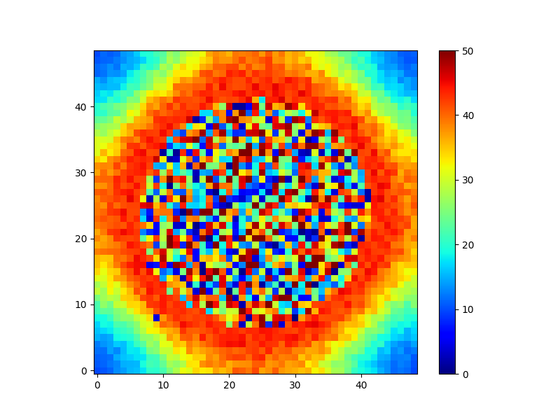

# Array of cells
## Spatio-temporal dynamics in cell layers with transport and diffusion through the medium

**Warning**: *this example requires a lot of computational resources creating the file with sbmodelr, editing the resulting file with COPASI, and running the simulation. All these operations take a long time, as described below, and require a computer with at least 16 Gb RAM (32Gb would be better). If you want to try a similar approach with a smaller model then use a smaller grid, such as 21x21 where the central unit has coordinates of 11,11.*

This follows the work of Schütze and Wolf (1) that used a core model of glycolysis with autocatalysis replicated in a 49x49 array. Each unit represents a cell and the medium in its vicinity, with transport of its two metabolites to and from the medium. The pathway roughly represents glycolysis with only two metabolites, *X* and *Y*, representing upper and lower glycolysis. Conversion of *X* to *Y* includes product activation (autocatalysis), *Y* is used for other processes and can also move to the medium. *X* is imported from the medium through an irreversible Michaelis-Menten process (active transport). The medium volume is set to be 10x larger than the cell volume. In this case the base model, *glycolysis-autocatalytic.cps*, contains the cell and the medium around it. The array of 49x49 units then connects the external metabolites (ie *X* and *Y* in the medium, named *Xex* and *Yex*) through reversible transport (akin to diffusion).

Here we will use a COPASI version of the single cell and its surrounding medium, *glycolysis-autocatalytic.cps*, as the base unit and make the larger models of 49x49 units. Because this is a square array of units, we do not have to provide a network file with the specific connectivity; *sbmodelr* will connect all neighboring cells in a square array topology automatically since we provide 2D dimensions (i.e. 49 49)

### Case 1
This replicates the results of Figure 4 of Reference 1. In this case only *Xex* diffuses between neighboring spaces (*Yex* is immobile). The *alpha* parameter (basal rate of the reaction converting *X* to *Y*) is allowed to vary between cells by +/- 10%. Parameter *Jin* is zero for all the units, except that it is set at 720.3 in the central unit (coordinates 25,25). The large model can be created with the command in file *ex3case1.sh*:

| command line options             | comment                                   |
| -------------------------------- | ----------------------------------------- |
|``sbmodelr``                      | run *sbmodelr*                            |
|`` --output ex3case1.cps``        | name the output file                      |
|`` -t Xex``                       | transport the species Xex                 |
|`` -k 5``                         | value of rate constant for transport      |
|`` --pn alpha 0.1 uni \``         | add noise to parameter alpha in each unit |
|`` glycolysis-autocatalytic.cps`` | COPASI file with the base unit            |
|`` 49 49``                        | create an array of 49x49 units            |

Running the command explained above (e.g. by running file *ex3case1.sh*) results in a new model file *ex3case1.cps*. Note that this takes a rather long time (38 minutes on a Xeon 3.4 GHz)! This is because the generated model has 2,401 units, resulting in a model with 4,802 compartments, 9,604 species, 16,709 reactions and 21,610 parameters!

We then have to load this model into COPASI (which also takes several minutes) in order to:

 1. set the *Jin_25,25* parameter to 720.3 (leave all other *Jin_i,j* at 0)
 2. create a report with time and all the [*X_i,j*] species
 3. in the time course task set the executable flag
 4. in the time course task set a report using the template created in 2.
 5. in the time course task set to suppress output before 790 s
 6. run the time course
 7. alternative to step 6. you can save the file as *ex3case1ready.cps* and then run it on the command line using ``CopasiSE ex3case1ready.cps`` and the output file will be created with the data needed to plot a figure similar to Fig. 4

Note that most operations on this model by the COPASI GUI (steps 1-6 above) are currently very slow (at least up to version 4.44); the COPASI team is actively profiling the software with large models such as this one to improve its performance. COPASI needs a minimum of 16Gb of RAM to process this file, if your computer has less than that do not attempt to load this file!

Because of Github limitations on file sizes, we uploaded here *ex3case1.omex* instead of *ex3case1.cps* and *ex3case1ready.omex* instead of *ex3case1ready.cps*. The *omex* files (COMBINE archive files, see reference 2) contain the COPASI files inside and are much smaller because they are compressed. You can load them into COPASI by using the file menu option "Import Combine Archive".

After doing the operations 1-7 above, and running the modified *ex3case1ready.cps* (warning: it took over 2 hours), we obtain data reproducing the behavior displayed in Fig. 4 of reference 1. We use a small python program (*ex3case1_plot.py*) to plot the data for time 800 using the matplotlib library (Fig 1.)

**Fig. 1.** Reproduction of behavior in Fig.4 of reference 1. Note the same type of (apparently) random values at a circle in the center. In this case the corners  still have low values, but in their figure they are already high, this is likely becasue the initial conditions were not described in reference 1 and are likely different from those used here. Note that Ref. 1 indexes the units in a range [-24,24], where this figure shows [0,49], so our center unit in this figure is 24,24, which corresponds to 0,0 in the original.

### Case 2

We now replicate the results of Figures 5A and 6A. This case is similar to the previous however now *Yex* also diffuses across neighboring units. The new model is created this way (file *ex3case2.sh*):

| command line options             | comment                                   |
| -------------------------------- | ----------------------------------------- |
|``sbmodelr``                      | run *sbmodelr*                            |
|`` --output ex3case2.cps``        | name the output file                      |
|`` -t Xex``                       | transport the species Xex                 |
|`` -t Yex``                       | transport the species Yex                 |
|`` -k 5``                         | value of rate constant for transport      |
|`` --pn alpha 0.1 uni \``         | add noise to parameter alpha in each unit |
|`` glycolysis-autocatalytic.cps`` | COPASI file with the base unit            |
|`` 49 49``                        | create an array of 49x49 units            |

Running the command explained above (e.g. by running file *ex3case2.sh*) results in a new model file *ex3case2.cps*. As previously, we have to load this new file into the COPASI GUI to change the parameter *Jin_25,25*; and now additionally change parameter *k_Yex_transport*, the rate of "diffusion" of *Yex*, which takes value 10 as described in Figure 5 of Reference 1. Note that *sbmodelr* has only one option to specify the rate of transport and then it sets all rates of transport to that value. This is how we alter the new file in the COPASI GUI:

 1. set the *Jin_25,25* parameter to 720.3 (leave all other *Jin_i,j* at 0)
 2. set the *k_Yex_transport* to 10
 3. create a report with time and all the [*X_25,j*] species (for the middle line, as in Figs. 5A and 6A of ref. 1)
 4. in the time course task set the executable flag
 5. in the time course task set a report using the template created in 3.
 6. in the time course task set to suppress output before 700 s
 7. run the time course
 8. alternative to step 7. you can save the file as *ex3case2ready.cps* and then run it on the command line using ``CopasiSE ex3case2ready.cps`` and the output file will be created with the data needed to plot a figure similar to Figs. 5A and 6A

Because of Github limitations on file sizes, we uploaded here *ex3case1.omex* instead of *ex3case2.cps* and *ex3case2ready.omex* instead of *ex3case1ready.cps*. The *omex* files (COMBINE archive files, see reference 2) contain the COPASI files inside and are much smaller because they are compressed. You can load them into COPASI by using the file menu option "Import Combine Archive".

**Fig. 2.** Reproduction of behavior in Fig.5A of reference 1. Note here we obtain a behavior similar to their Fig5B, where there are three types of waves interleaved, instead of just one. It is not clear why this is different from the paper, though it could be that the published paper does not describe the exact parameters obtained in their figure 1. Another possibility is that the randomness of the alpha parameter may cause different results at different times. Ref. 1 indexes the units in a range [-24,24], where this figure shows [0,49], so our center unit in this figure is 24, which corresponds to 0 in the original paper. This figure was created with matplotlib (file *ex3case2_plot.py*).

## References and notes

1. Schütze J, Wolf J (2010) Spatio-temporal dynamics of glycolysis in cell layers. A mathematical model. [BioSystems 99:104–108](https://doi.org/10.1016/j.biosystems.2009.10.002)

2. Bergmann FT, *et al.* (2014) COMBINE archive and OMEX format: one file to share all information to reproduce a modeling project. [BMC Bioinformatics 15:369](https://doi.org/10.1186/s12859-014-0369-z)
