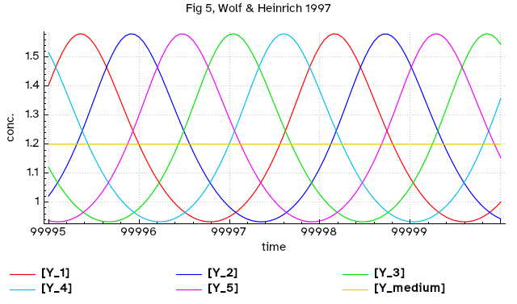
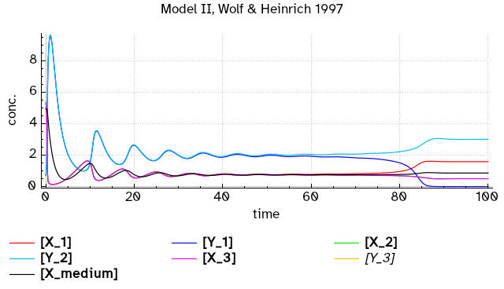

# Cells in medium
## Synchronization of cells through transport of metabolites to the medium

This follows the work of Wolf and Heinrich (1), which takes a simple model of glycolytic oscillations (2) as the base unit (a cell with oscillating glycolysis) and creates a new model with suspensions consisting of an arbitrary number N of interacting units. The individual cells interact via the flux of metabolites, which are produced in all cells and may permeate through the cell membranes (1). Two specific cases are examined: in Model I the coupling is via the product of the autocatalytic reaction (species Y), and in Model II the coupling is via the substrate of the autocatalytic reaction (species X).

We create several examples following (1) using either Model I or II. Each example is codified in a shell script that calls *sbmodelr* using a base COPASI file *Selkov-Wolf-Heinrich.cps* which encodes the basic model for a single unit. This model is then extended by specifying the metabolite to be transported (Y for Model I, and X for Model II), creating a medium with the appropriate volume (5-fold larger than the total volume of all cells, according to ref. 1), and different initial conditions for each unit. Included in this folder are all the files produced by *sbmodelr* and COPASI.

### Case 1
This uses Model I, with 2 cells producing synchronous oscillations (file *ex1case1.sh*). We set the two cells to have
different initial conditions (options ``--pn``), set the transport rate constant for transport to be 3.2, as in
Fig. 3 of ref. 1), and the medium volume to be 10 (to keep the ratio of volumes to 0.2 as in ref. 1).

| command line options         | comment                              |
| ---------------------------- | ------------------------------------ |
|``sbmodelr``                  | run *sbmodelr*                       |
|`` --output case1.cps``       | name the output file                 |
|`` --add-medium``             | include a medium unit                |
|`` --medium-volume 10``       | set medium volume (5*N)              |
|`` --transport Y``            | transport the species Y (Model I)    |
|`` --transport-k 3.2``        | value of rate constant for transport |
|`` --pn X 0.1 uni``           | initial values of X inside +/-10% interval around value of X in base |
|`` --pn Y 0.1 uni``           | initial values of Y inside +/-10% interval around value of Y in base |
|`` Selkov-Wolf-Heinrich.cps`` | COPASI file with the base unit       |
|`` 2``                        | create 2 units                       |

Running the command explained above (e.g. by running file *ex1case1.sh*) results in a new model file *case1.cps*.
Loading that file into COPASI, creating a plot for Y_1, Y_2 and Y_medium, and adjusting its axes,
reproduces Fig. 3 of reference 1.

### Case 2
This uses Model I, with 5 cells producing regular asynchronous oscillations (file *ex1case2.sh*). We set the five
cells to have different initial conditions (options ``--pn``), set the transport rate constant for transport to be 1,
as in Fig. 3 of ref. 1), and the medium volume to be 25 (to keep the ratio of intracellular over extracellular volume to
0.2 as in ref. 1). We use a different base file, *Selkov-Wolf-Heinrich_k2.5.cps*, which only differs from the one used
in case 1 by setting the constant k=2.5 (instead of 3.84).

| command line options              | comment                              |
| --------------------------------- | ------------------------------------ |
|``sbmodelr``                       | run *sbmodelr*                       |
|`` --output case2.cps``            | name the output file                 |
|`` --add-medium``                  | include a medium unit                |
|`` --medium-volume 25``            | set medium volume (5*N)              |
|`` --transport Y``                 | transport the species Y (Model I)    |
|`` --transport-k 1``               | value of rate constant for transport |
|`` --pn X 0.1 uni``                | initial values of X inside +/-10% interval around value of X in base |
|`` --pn Y 0.1 uni``                | initial values of Y inside +/-10% interval around value of Y in base |
|`` Selkov-Wolf-Heinrich_k2.5.cps`` | COPASI file with the base unit       |
|`` 5``                             | create 5 units                       |

Running the command explained above (e.g. by running file *ex1case2.sh*) results in a new model file *case2.cps*.
Loading that file into COPASI, creating a plot for Y_1, Y_2, Y_3, Y_4, Y_5 and Y_medium, and adjusting its axes,
reproduces Fig. 5 of reference 1.

### Case 3
This uses Model II, with 3 cells producing a stable steady state but with oscillations before convergence
(file *ex1case3.sh*). We set the three cells to have different initial conditions (options ``--pn``),
set the transport rate constant for transport to be 4.16, as in, and the medium volume to be 15 (to keep
the ratio of volumes to 0.2 as in ref. 1).

| command line options         | comment                              |
| --------------------------------- | ------------------------------------ |
|``sbmodelr``                       | run *sbmodelr*                       |
|`` --output case3.cps``            | name the output file                 |
|`` --add-medium``                  | include a medium unit                |
|`` --medium-volume 15``            | set medium volume (5*N)              |
|`` --transport X``                 | transport the species X (Model II)   |
|`` --transport-k 4.16``            | value of rate constant for transport |
|`` --pn X 0.1 uni``                | initial values of X inside +/-10% interval around value of X in base |
|`` --pn Y 0.1 uni``                | initial values of Y inside +/-10% interval around value of Y in base |
|`` Selkov-Wolf-Heinrich_k1.5.cps`` | COPASI file with the base unit       |
|`` 3``                             | create 3 units                       |

Running the command explained above (e.g. by running file *ex1case3.sh*) results in a new model file *case3.cps*.
Loading that file into COPASI, creating a plot for X_1, Y_1, X_2, Y_2, X_3, Y_3, and Y_medium displays the complex
approach to the steady state with oscillations. Note that not all units converge to the same steady state. This
corresponds to a small region in the bifurcation diagram of Fig. 12 of reference 1 (between lines kappa_c and
kappa_a).

## References

1. Wolf J, Heinrich R (1997) Dynamics of two-component biochemical systems in interacting cells; synchronization and desynchronization of oscillations and multiple steady states. [BioSystems 43:1–24](https://doi.org/10.1016/s0303-2647(97)01688-2)
2. Sel’kov EE (1968) Self-oscillations in glycolysis. 1. A simple kinetic model. [European Journal of Biochemistry 4:79–86](https://doi.org/10.1111/j.1432-1033.1968.tb00175.x)
