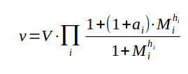
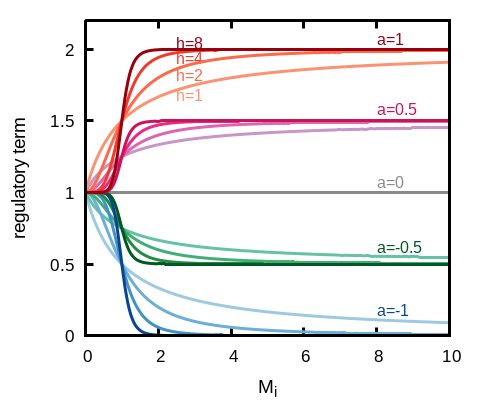

# Gene regulatory networks

This example takes a base unit defining a simple model for expression of one gene and uses it to create gene regulatory networks. When creating this type of networks *sbmodelr* adds one synthesis reaction to each species where that reaction has a number of effectors (determined by the topology) and each effector can be an inducer or repressor, according to a kinetic function that multiplies one generic term per effector. The equation is expressed as:

where *V* is a maximal rate parameter, *M_i* is the modifier species, *h_i* is a Hill coefficient that expresses a degree of cooperativity (can be any integer between 1-10), and *a_i* is a parameter that encodes the sign and strength of the interaction; *a_i* can be any value between -1 and +1, where -1 is full strength repression, and +1 is full strength induction; a value of zero makes that modifier have no effect. Note that this equation makes the effect of all modifiers to be non-additive (*e.g.* if one term becomes zero, the rate will be zero irrespective of the concentrations of any other modifier). The effect of each modifier (*i.e.* the value of their corresponding regulatory term) is represented graphically below, showing the effect of *a_i* and *h_i* parameters.

### Case 1

We create a small network of inhibitory genes, known as the "repressilator", described by

File *ex6case1.sh* contains the full *sbmodelr* command required to create the new model.

| command line options       | comment                                                                |
| -------------------------- | ---------------------------------------------------------------------- |
|``sbmodelr``                | run *sbmodelr*                                                         |
|`` --output ex5case1.cps``  | name the output file                                                   |
|`` -n network100-200.dot``  | network file with 100 randomly connected neurons and 200 synapses      |
|`` --ode-synaptic v``       | indicate global quantity that holds voltage (v) where the synapse acts |
|`` --synapse-g 0.2``        | set the synaptic conductance value                                     |
|`` --synapse-link-g``       | link all synapse conductances to a single global quantity              |
|`` Izhikevich.cps``         | COPASI file with the Izhikevich neuron base unit                       |
|`` 100``                    | create 100 units                                                       |

## References

1.

