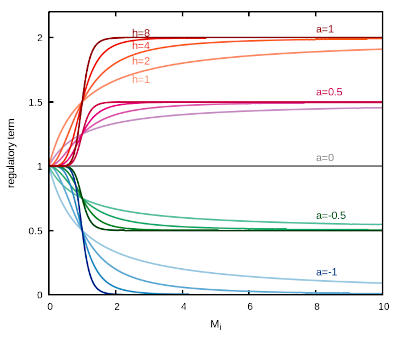

# Gene regulatory networks

This example takes a base unit defining a simple model for expression of one gene and uses it to create gene regulatory networks. When creating this type of networks *sbmodelr* adds one synthesis reaction to each species where that reaction has a number of effectors (determined by the topology) and each effector can be an inducer or repressor, according to a kinetic function that multiplies one generic term per effector. The equation is expressed as:


where *V* is a maximal rate parameter, *M_i* is the effector species, *h_i* is a Hill coefficient that expresses a degree of cooperativity (can be any integer between 1-10), and *a_i* is a parameter that encodes the sign and strength of the interaction; *a_i* can be any value between -1 and +1, where -1 is full strength repression, and +1 is full strength induction; a value of zero makes that effector have no effect. Note that this equation makes the effect of all effectors to be non-additive (*e.g.* if one term becomes zero, the rate will be zero irrespective of the concentrations of any other effector). The effect of each effector *M_1* (*i.e.* the value of their corresponding regulatory term) is represented graphically below, showing the effect of *a_i* and *h_i* parameters.



### Case 1

We create a small network of inhibitory genes, known as the "repressilator", described by Elowitz and Leibler (1). This network consists of three genes inhibiting each other in a triangle. The network is expressed by the file *3circle.gv*:

```
digraph _3circle{
// three nodes affecting each other in a circle
1 -> 2
2 -> 3
3 -> 1
}
```


File *ex6case1.sh* contains the full *sbmodelr* command required to create the new model.

| command line options       | comment                                                                |
| -------------------------- | ---------------------------------------------------------------------- |
|``sbmodelr``                | run *sbmodelr*                                                         |
|`` --output ex6case1.cps``  | name the output file                                                   |
|`` -n 3circle.gv``          | network file with a triangle of interacting units                      |
|`` -g G \``                 | indicate species interacting between units through regulatory synthesis|
|`` --ignore-compartments \``| put everything inside a single compartment                             |
|`` --grn-a -1``             | set interactions to be repressions                                     |
|`` --grn-h 4``              | add some cooperativity (sigmoid repression curves)                     |
|`` --pn G 0.8 uni``         | sample initial concentrations uniformly within +/-80% original value   |
|`` GenExBase.cps``          | COPASI file with the base model for gene expression                    |
|`` 3``                      | create 3 units                                                         |


## References

1. Elowitz MB, Leibler S (2000) A synthetic oscillatory network of transcriptional regulators. [Nature 403:335–338](https://doi.org/10.1038/35002125)


