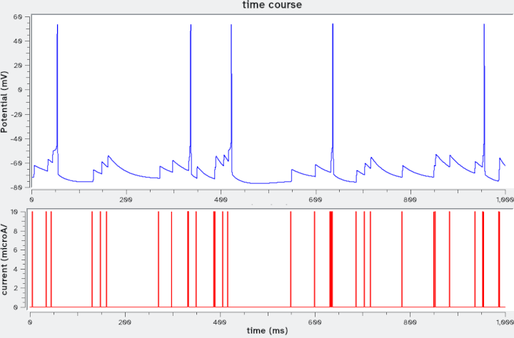
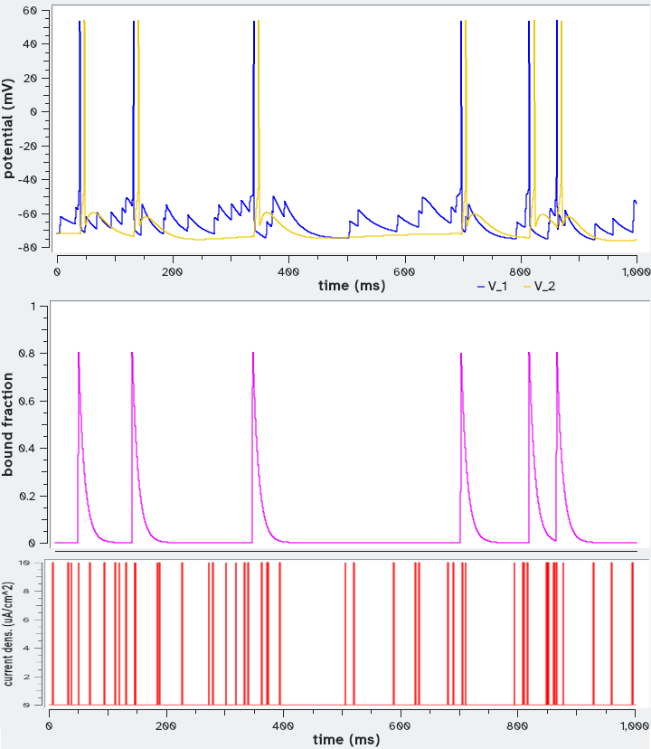

# Neuron networks I
## Networks of Hodgkin-Huxley-type neurons with chemical synapses

This example takes a base unit defining a neuron model (1) to make neuron network motifs. The neurons are connected by chemical synapses using the approach of Destexhe *et al.* (2). This approach adds one ODE for each synapse, representing the proportion of occupied post-synaptic neurotransmitter receptor. This approach for chemical synapses is available in *sbmodelr* with the option ``--ode-synaptic`` (or short option ``-s``), which identifies the global quantity of type ODE that represents membrane potential (voltage) in the neuron unit. This chemical synapse approach (2) allows making the synapses excitatory or inhibitory through the parameter *Vsyn* of the synapse (the synaptic reversal potential). Other synapse parameters relate to the characteristic time for neurotransmitter release (*tau_r*) and degradation (*tau_d*) and a reverse potential (*V0*).

The base model used here, defined by Pospischil *et al.* (1), is a Hodgkin-Huxley-type model that can replicate several types of neurons depending on the parameter values. The COPASI model includes the three parameter sets defined in (1), for fast spiking (FS) neurons, regular spiking with adaptation (RSA) neurons, and intrinsically bursting (IS) neurons. To create one specific neuron of the appropriate type you would load the *GenericNeuron.cps* model into COPASI, go to Model/Parameter Sets, chose the appropriate one, click "Apply", and then save the new model. This repository already includes the RSA neuron model (file *RSA_neuron.cps*).

The base unit model also contains two events that set random values of an injected current into the neuron. When we create networks with this base unit, we will delete most of the new events such that only one unit has injected current (*sbmodelr* replicates the event to all the units, but in this example we want it for only one of them).

### Case 1
We will use a base model *RSA_neuron.cps* that captures the behavior of a single neuron when it receives a sequence of current pulses of 10 µA/cm2 for 1ms, spaced according to a Poisson distribution with an average of 1 pulse per 25 ms. These inputs eventually cause action potentials, shown in the figure below in the top panel in blue; the bottom panel shows the input current pulses in red.



We now create a simple feedforward network motif where one such RSA neuron connects to another one. The *ff2.dot* network file specifies the network and looks simply like this:

```
digraph ff2{
// feedforward motif with two nodes
1 -> 2
}
```

File *ex4case1.sh* contains the full *sbmodeler* command required to create the new model.

| command line options       | comment                                                                |
| -------------------------- | ---------------------------------------------------------------------- |
|``sbmodelr``                | run *sbmodelr*                                                         |
|`` --output ex4case1.cps``  | name the output file                                                   |
|`` -n ff2.dot``             | network file that has simple 2-neuron feedforward motif                |
|`` --ode-synaptic V``       | indicate global quantity that holds voltage (V) where the synapse acts |
|`` --synapse-g 0.08``       | set the synaptic conductance value                                     |
|`` RSA_neuron.cps``         | COPASI file with the RSA neuron base unit                              |
|`` 2``                      | create 2 units                                                         |

Running the command explained above (e.g. by running file *ex1case1.sh*) results in a new model file *ex4case1.cps*.
After loading that file into COPASI we make the following modifications:
 1. delete the events for unit 2 (*pulse_on_2* and *pulse_off_2*)
 2. create a time course plot for *I_inj_1* (injected current into neuron 1), *V_1* (neuron 1 membrane potential), *V_2* (neuron 1 membrane potential) and *br_V_1,2* (proportion of bound synaptic receptor)

Below is a representative time course (each time course is different, given the random spacing of the current inputs). At the top are the membrane potentials of the two neurons, with neuron 1 in blue and neuron 2 in yellow. The middle panel shows the proportion of bound receptor in the post-synaptic membrane, and the bottom panel shows the current inputs into neuron 1. Neuron 2 is responding to action potentials from neuron 1 with its own action potentials at a short delay.



### Case 2


## References

1. Pospischil M, Toledo-Rodriguez M, Monier C, Piwkowska Z, Bal T, Frégnac Y, Markram H, Destexhe A (2008) Minimal Hodgkin–Huxley type models for different classes of cortical and thalamic neurons. [Biological Cybernetics 99:427–441](https://doi.org/10.1007/s00422-008-0263-8)
2. Destexhe A, Mainen ZF, Sejnowski TJ (1994) An Efficient Method for Computing Synaptic Conductances Based on a Kinetic Model of Receptor Binding. [Neural Computation 6:14–18](https://doi.org/10.1162/neco.1994.6.1.14)
3. Giannari AG, Astolfi A (2022) Model design for networks of heterogeneous Hodgkin–Huxley neurons. [Neurocomputing 496:147–157](https://doi.org/10.1016/j.neucom.2022.04.115)

