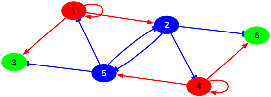
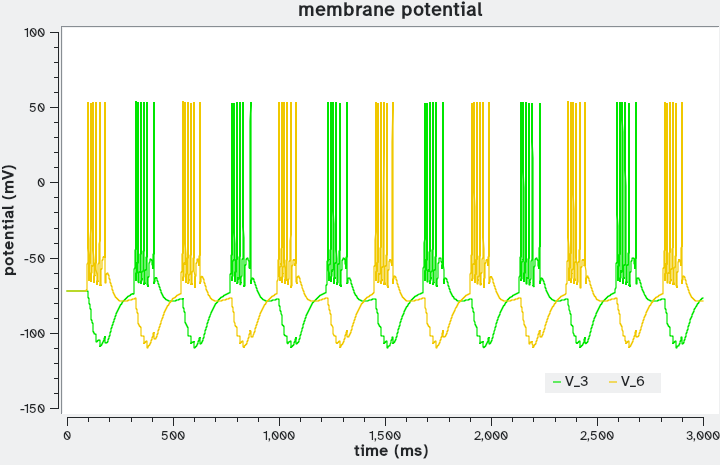

# Neuron networks I
## Networks of Hodgkin-Huxley-type neurons with chemical synapses

This example takes a base unit defining a generic neuron model (1) to make neuron network motifs. The neurons are connected by chemical synapses using the approach of Destexhe *et al.* (2). This approach adds one ODE for each synapse, representing the fraction of occupied post-synaptic neurotransmitter receptor. This approach for chemical synapses is available in *sbmodelr* with the option ``--ode-synaptic`` (or short option ``-s``), which identifies the global quantity of type ODE that represents membrane potential (voltage) in the neuron unit. This chemical synapse approach (2) allows making the synapses excitatory or inhibitory through the parameter *Vsyn* of the synapse (the synaptic reversal potential). Other synapse parameters relate to the characteristic time for neurotransmitter release (*tau_r*) and degradation (*tau_d*) and its reverse potential (*V0*).

The base model used here, defined by Pospischil *et al.* (1), is a Hodgkin-Huxley-type model that can replicate several types of neurons depending on the parameter values. The COPASI model includes the three parameter sets defined in (1), for fast spiking (FS) neurons, regular spiking with adaptation (RSA) neurons, and intrinsically bursting (IS) neurons. To create one specific neuron of the appropriate type you would load the *GenericNeuron.cps* model into COPASI, go to Model/Parameter Sets, chose the appropriate one, click "Apply", and then save the new model. This repository already includes the RSA neuron model (file *RSA_neuron.cps*), which is used here as the base unit.

The base unit model also contains two events that inject current pulses into the neuron spaced through a Poisson distribution. When we create networks with this base unit, *sbmodelr* will also replicate the events into every other neuron. If left unmodified, then each neuron receives its own independent Poisson stream of pulses. This is, generally, not what we want, instead we want only one or a few neurons to receive these pulses, so we will delete most of the newly created events.

It is useful to briefly study the behavior of the base unit model *RSA_neuron.cps* before we employ it to build network motifs of several neurons. As mentioned above, this neuron receives a sequence of 1ms current pulses of 10 µA/cm2, spaced according to a Poisson distribution with an average of 1 pulse per 25 ms. These pulses eventually cause action potentials. The figure below shows a typical time course of this single neuron model. The top panel displays the membrane potential of the neuron, in blue, while the bottom panel shows the input current pulses in red.


Below we construct several neuron network motifs inspired by the work of Giannari and Astolfi (3), except that here all the synapses are chemical (Destexhe *et al.* type) whereas in their publication they have a mix of chemical and electrical synapses (the latter can also be generated by *sbmodler*, however a combination of the two is not currently possible).

### Case 1

We create a simple feedforward network motif where one such RSA neuron connects to another one. The *ff2.dot* network file specifies the network and looks simply like this:

```
digraph ff2{
// feedforward motif with two nodes
1 -> 2
}
```

File *ex4case1.sh* contains the full *sbmodelr* command required to create the new model.

| command line options       | comment                                                                |
| -------------------------- | ---------------------------------------------------------------------- |
|``sbmodelr``                | run *sbmodelr*                                                         |
|`` --output ex4case1.cps``  | name the output file                                                   |
|`` -n ff2.dot``             | network file that has simple 2-neuron feedforward motif                |
|`` --ode-synaptic V``       | indicate global quantity that holds voltage (V) where the synapse acts |
|`` --synapse-g 0.08``       | set the synaptic conductance value                                     |
|`` RSA_neuron.cps``         | COPASI file with the RSA neuron base unit                              |
|`` 2``                      | create 2 units                                                         |

Running the command explained above (e.g. by running file *ex4case1.sh*) results in a new model file *ex4case1.cps*.
After loading that file into COPASI we make the following modifications:
 1. delete the events for unit 2 (*pulse_on_2* and *pulse_off_2*)
 2. create a time course plot for *I_inj_1* (injected current into neuron 1), *V_1* (neuron 1 membrane potential), *V_2* (neuron 2 membrane potential) and *br_V_1,2* (proportion of bound synaptic receptor)
 3. save the file (*ex4case1.cps*)

Below is a representative time course generated from *ex4case1.cps* after the modifications. Note that each time course is different, given the random spacing of the current inputs. At the top are the membrane potentials of the two neurons, with neuron 1 in blue and neuron 2 in yellow. The middle panel shows the proportion of bound receptor in the post-synaptic membrane, and the bottom panel shows the current inputs into neuron 1. Neuron 2 is responding to action potentials from neuron 1 with its own action potentials at a short delay.


### Case 2

We now look at the case where neuron 2 feeds back to neuron 1. The network file used (*fb2.dot*) looks like this:

```
digraph fb2{
// feedback motif with two nodes
1 -> 2
2 -> 1
}
```

File *ex4case2.sh* contains the full *sbmodeler* command required to create the new model.

| command line options       | comment                                                                |
| -------------------------- | ---------------------------------------------------------------------- |
|``sbmodelr``                | run *sbmodelr*                                                         |
|`` --output ex4case2.cps``  | name the output file                                                   |
|`` -n fb2.dot``             | network file that has simple 2-neuron feedback motif                   |
|`` --ode-synaptic V``       | indicate global quantity that holds voltage (V) where the synapse acts |
|`` --synapse-g 0.08``       | set the synaptic conductance value                                     |
|`` RSA_neuron.cps``         | COPASI file with the RSA neuron base unit                              |
|`` 2``                      | create 2 units                                                         |

Running the command explained above (e.g. by running file *ex4case2.sh*) results in a new model file *ex4case2.cps*.
After loading that file into COPASI we make the following modifications:
 1. switch off the events for unit 2 by adding ``and false`` to the trigger expression of event *pulse_on_2* (this will allow later turning it on again by removing this, and not having to delete and re-create the event). The Trigger Expression should read: ``{Time} > {Values[pulse_on_2]} and false`` .
 2. create a time course plot for *I_inj_1* (injected current into neuron 1), *V_1* (neuron 1 membrane potential), *V_2* (neuron 2 membrane potential), *br_V_1,2* (proportion of bound receptor in synapse 1->2), and *br_V_2,1* (proportion of bound receptor in synapse 2->1)
 3. save the file (*ex4case2.cps*)

The file *ex4case2.cps* has now two neurons connected in a **positive** feedback motif, since both synapses are excitatory. The behavior is displayed in the figure below.  At the top are the membrane potentials of the two neurons, with neuron 1 in blue and neuron 2 in yellow. The middle panel shows the proportion of bound receptors in the post-synaptic membranes (blue for synapse from 1 to 2, yellow for synapse 2 to 1), and the bottom panel shows the current inputs into neuron 1. As in case 1, neuron 2 responds to action potentials from neuron 1 with its own action potentials at a short delay. However, here the positive feedback loop causes a train of action potentials that eventually die out.


### Case 3

The next motif we examine is composed of 3 neurons: the feedforward loop. In this case neuron 1, which receives the input, has synapses leading to neuron 2 and neuron 3; neuron 2 also has a synapse leading to neuron 3. We will examine the interesting case where the synapse from neuron 2 to neuron 3 is inhibitory, while the other two are excitatory -- an incoherent feedforward loop.

Remember that the network file does not distinguish whether synapses are excitatory or inhibitory, it simply indicates what are the synapses. The network file to specify the 3-unit feedforward loop (*ff3.dot*) looks like this:

```
digraph ff3{
// feedforward motif with three nodes
1 -> 2
2 -> 3
1 -> 3
}
```

In order to make the synpse 2->3 inhibitory we will have to change its *Vsyn* parameter (*Vsyn* is the post-synaptic inversion potential). This is because what distinguishes inhibitory and excitatory synapses, using the Destexhe *et al.* approach (2), is the value of *Vsyn* (much more negative for inhibitory synapses).

However, by default, *sbmodelr* creates only one global quantity for *Vsyn* that is used in all synapses (*i.e.* all synapses would be equal). But in this case we want *Vsyn* for synapse 2->3 to be different from the *Vsyn* from synapses 1->2 and 1>3, se we need to force *sbmodelr* to create separate parameters for each synapse. This can be achieved by requesting noise in the connectivity parameters (command line option ``--cn``), the resulting model then has one *Vsyn* for each synapse (as well as other synapse parameters). Thus we will use this option, but because we do not really need noise in the parameter values, we specify the noise magnitude to be zero, by including ``--cn 0 uni`` (it really does not matter if we use the uniform or normal distributions...)

File *ex4case3.sh* contains the full *sbmodelr* command required to create the new model.

| command line options       | comment                                                                |
| -------------------------- | ---------------------------------------------------------------------- |
|``sbmodelr``                | run *sbmodelr*                                                         |
|`` --output ex4case3.cps``  | name the output file                                                   |
|`` -n ff3.dot``             | network file that has the 3-neuron feedforward motif                   |
|`` --ode-synaptic V``       | indicate global quantity that holds voltage (V) where the synapse acts |
|`` --synapse-g 0.08``       | set the synaptic conductance value                                     |
|`` --cn 0 uni``             | add noise to synapse parameters (but set noise magnitude to zero!)     |
|`` RSA_neuron.cps``         | COPASI file with the RSA neuron base unit                              |
|`` 3``                      | create 3 units                                                         |

Running the command explained above (e.g. by running file *ex4case3.sh*) results in a new model file *ex4case3.cps*. After loading that file into COPASI we make the following modifications:
 1. delete events for units 2 and 3 (*pulse_on_2*, *pulse_off_2*, *pulse_on_3*, *pulse_off_3*).
 2. modify the value of global quantity *Vsyn_V_synapse_2-3* to -80 (inhibitory synapse)
 3. modify the value of global quantity *tau_d_V_synapse_2-3* to 100 (slower degradation of neurotransmitter)
 4. create a time course plot for *I_inj_1* (injected current into neuron 1), *V_1*, *V_2*, *V_3* (neuron membrane potentials), *br_V_1,2*, *br_V_1,3*, *br_V_2,3* (proportion of synapse's bound receptors)
 5. save the file (*ex4case3.cps*)

The file *ex4case3.cps* now fully represents the **incoherent** feedforward motif, where neuron 1 gives a direct excitatory signal to neuron 3 and an indirect inhibitory signal to neuron 3 (through neuron 2). The  inhibitory synapse is also slower at degrading the neurotransmitter (*e.g.* slower release from the receptor) than the other two synapses. A typical behavior is displayed in the figure below.  At the top are the membrane potentials of neurons 1 (blue) and 3 (green, we ommit neuron 2 as this is similar to case 2, it "copies" neuron 1 with a small delay). The middle panel shows the proportion of bound receptors in the post-synaptic membranes (blue for synapse from 1 to 2, green for synapse 2 to 3), and the bottom panel shows the current inputs into neuron 1. Here we see that neuron 3 also fires an action potential after neuron 1, however this only happens if there was a suffient delay since the previous action potential. If neuron 1 fires two short spaced action potentials, neuron 3 only responds to the first.


### Case 4

The final motif we examine here is composed of 6 neurons and is known as the spinal central pattern generator, and is a well conserved vertebrate motif that produces synchronized oscillations that control rhythmic locomotion (4). This is composed of three neurons on either side of the spine, with two top neurons (neurons 1 and 4) that activate all three on their side of the spine (*i.e.* neuron 1 activates itself, 2 and 3; neuron 4 activates itself, 5 and 6), two neurons (2 and 5) form inhibitory synapses to all three on the opposite side of the spine, and finally two neurons (3 and 6) provide signal to the muscle. The connectivity of this network is included in file *scpg.dot*:

```
digraph scpg{
// network for spinal central pattern generator

 nodesep=0.5;
 dpi=100
 size="5.5,3"
 node[ fontname="Arial Bold"; fontsize="17"; style="filled"]
 edge[ penwidth="2.5"]

 1 [color="red"]
 2 [color="blue"; fontcolor="white"]
 3 [color="green"]
 4 [color="red"]
 5 [color="blue"; fontcolor="white"]
 6 [color="green"]

 1 -> 1 [color="red"]
 1 -> 2 [color="red"]
 4 -> 4 [color="red"]
 4 -> 5 [color="red"]

 2 -> 4 [arrowhead="tee"; color="blue"]
 2 -> 5 [arrowhead="tee"; color="blue"]
 2 -> 6 [arrowhead="tee"; color="blue"]
 5 -> 1 [arrowhead="tee"; color="blue"]
 5 -> 2 [arrowhead="tee"; color="blue"]
 5 -> 3 [arrowhead="tee"; color="blue"]

 1 -> 3 [color="red"]
 4 -> 6 [color="red"]
}
```

Note that this GraphViz file contains more information than is needed by *sbmodelr* (node colors, arrowhead shapes, and other attributes) so as to produce a nice image of the network (using GraphViz itself: `sfdp -Tpng -o scpg.png scpg.dot`). Red arrows represent excitatory synapses, blue blunted arrows represent inhibitory synapses, the green nodes represent motor neurons.



File *ex4case4.sh* contains the full *sbmodelr* command required to create the new model.

| command line options       | comment                                                                |
| -------------------------- | ---------------------------------------------------------------------- |
|``sbmodelr``                | run *sbmodelr*                                                         |
|`` --output ex4case4.cps``  | name the output file                                                   |
|`` -n scpg.dot``            | network file that has the spinal central pattern generator motif       |
|`` --ode-synaptic V``       | indicate global quantity that holds voltage (V) where the synapse acts |
|`` --synapse-g 0.08``       | set the synaptic conductance value                                     |
|`` --cn 0 uni``             | add noise to synapse parameters (but set noise magnitude to zero!)     |
|`` RSA_neuron.cps``         | COPASI file with the RSA neuron base unit                              |
|`` 6``                      | create 6 units                                                         |

Running the command explained above (e.g. by running file *ex4case4.sh*) results in a new model file *ex4case4.cps*. After loading that file into COPASI we make the following modifications:
 1. delete all events
 2. modify the value of global quantities *Vsyn_V_synapse_2-4*, *Vsyn_V_synapse_2-5*, *Vsyn_V_synapse_2-6*, *Vsyn_V_synapse_5-1*, *Vsyn_V_synapse_5-2*, *Vsyn_V_synapse_5-3* to -80 (inhibitory synapses)
 3. set the values of *I_inj_1* to 0.5 and *I_inj_4* to 0.519
 4. create a time course plot for *V_3*, and *V_6*
 5. save the file (*ex4case4.cps*)
In step 2 we set the synapses from neurons 2 and 5 to be inhibitory; in step 3 we add some injected current to neurons 1 and 4 (the input neurons) -- their values are different in order to cause asymetry; alternatively this could have been done by adding random injected currents to each one (the asymetry is needed just to start off the oscillations)

The file *ex4case4.cps* now fully represents the spinal central pattern generator, where neurons 1 and 4 excite all neurons on their side of the spine, neuros 2 and 5 inhibit neurons on the other side of the spine. We plot the membrane potentials at the motor neurons (3 and 6). This motif then generates bursts on the motor neurons, at alternate times (*i.e.* 180 degrees out of phase), which would generate alternate contractions on each side of the spine .




## References

1. Pospischil M, Toledo-Rodriguez M, Monier C, Piwkowska Z, Bal T, Frégnac Y, Markram H, Destexhe A (2008) Minimal Hodgkin–Huxley type models for different classes of cortical and thalamic neurons. [Biological Cybernetics 99:427–441](https://doi.org/10.1007/s00422-008-0263-8)
2. Destexhe A, Mainen ZF, Sejnowski TJ (1994) An Efficient Method for Computing Synaptic Conductances Based on a Kinetic Model of Receptor Binding. [Neural Computation 6:14–18](https://doi.org/10.1162/neco.1994.6.1.14)
3. Giannari AG, Astolfi A (2022) Model design for networks of heterogeneous Hodgkin–Huxley neurons. [Neurocomputing 496:147–157](https://doi.org/10.1016/j.neucom.2022.04.115)
4. Alford ST, Alpert MH (2014) A synaptic mechanism for network synchrony. [Frontiers in Cellular Neuroscience 8:290](https://doi.org/10.3389/fncel.2014.00290)

