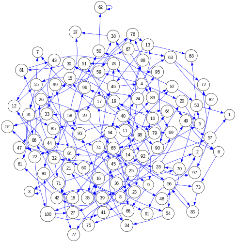
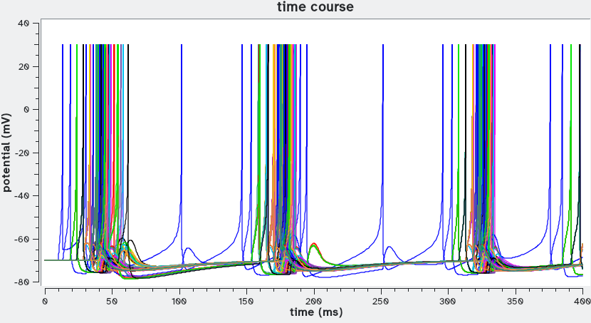
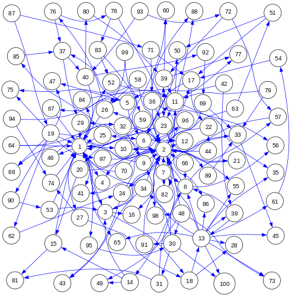
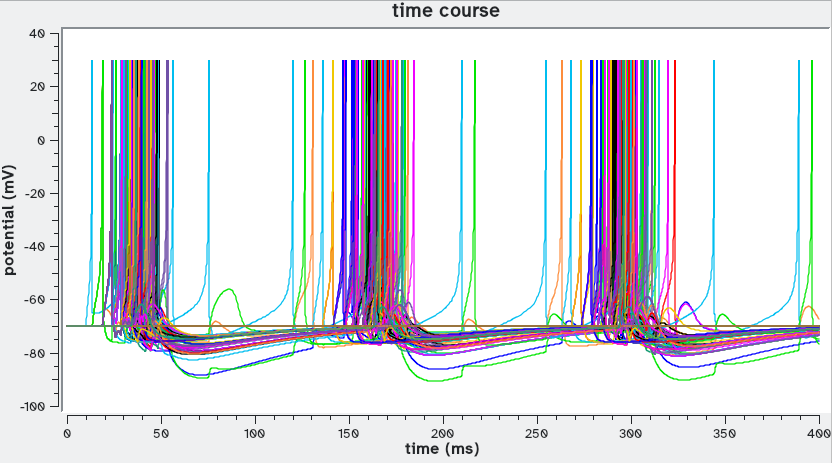

# Neuron networks II
## Large Networks of reduced neuron models

This example takes a base unit defining a reduced model of a neuron and creates larger neural networks. Because of the size of the network, it is useful to have a small model as the base unit for each neuron, in order to reduce the the size of the resulting network model and its computation time. One of the earliest such models is the FitzHugh-Nagumo model (1,2), which represents spiking neurons but few other features and does not have easy biological interpretation. More recently, Izhikevich proposed a smaller model (3), and which is faster to compute, yet is easier to interpret biologically. The Izhikevich model includes an intrinsic event which allows it to have fewer differential equations. In addition the Izhikevich neuron can replicate the behaviour of a large class of neurons by adjusting its parameter values, becoming an ideal base unit for larger spiking neural network models.

### Case 1

We create a network of 100 neurons, each one with two incoming chemical synapses connected randomly, for a total of 200 synapses. This network is encoded in the file *network100-200.dot*. The neurons are based on the Izhikevich model and were tuned to be regular spiking neurons. The network is depicted below:

File *ex5case1.sh* contains the full *sbmodelr* command required to create the new model.

| command line options       | comment                                                                |
| -------------------------- | ---------------------------------------------------------------------- |
|``sbmodelr``                | run *sbmodelr*                                                         |
|`` --output ex5case1.cps``  | name the output file                                                   |
|`` -n network100-200.dot``  | network file with 100 randomly connected neurons and 200 synapses      |
|`` --ode-synaptic v``       | indicate global quantity that holds voltage (v) where the synapse acts |
|`` --synapse-g 0.2``        | set the synaptic conductance value                                     |
|`` --synapse-link-g``       | link all synapse conductances to a single global quantity              |
|`` Izhikevich.cps``         | COPASI file with the Izhikevich neuron base unit                       |
|`` 100``                    | create 100 units                                                       |

Running the command explained above (e.g. by running file ex5case1.sh) results in a new model file ex5case1.cps. After loading that file into COPASI we make the following modifications:

1. for event "Stimulus" delete all targets except *Values[i_29]*, so that only one neuron (29) receives a a current input
2. create a time course plot for for all *v_i* (*v_1* to *v_100*)
3. save the file as ex4case1ready.cps

Below is a representative time course generated from ex5case1ready.cps. Note that there is a certain synchronization of action potentials happening at periodic times.

### Case 2

We create another network of 100 neurons, each one with two incoming chemical synapses, for a total of 200 synapses. This time they network follows a scale-free topology. This network is encoded in the file *network100-200_sf.dot*. The neurons are based on the Izhikevich model and were tuned to be regular spiking neurons. The network is depicted below:

File *ex5case2.sh* contains the full *sbmodelr* command required to create the new model.

| command line options        | comment                                                                |
| --------------------------- | ---------------------------------------------------------------------- |
|``sbmodelr``                 | run *sbmodelr*                                                         |
|`` --output ex5case2.cps``   | name the output file                                                   |
|`` -n network100-200_sf.dot``| network file with 100 randomly connected neurons in scale free network with 200 synapses  |
|`` --ode-synaptic v``        | indicate global quantity that holds voltage (v) where the synapse acts |
|`` --synapse-g 0.2``         | set the synaptic conductance value                                     |
|`` --synapse-link-g``        | link all synapse conductances to a single global quantity              |
|`` Izhikevich.cps``          | COPASI file with the Izhikevich neuron base unit                       |
|`` 100``                     | create 100 units                                                       |

Running the command explained above (e.g. by running file ex5case2.sh) results in a new model file ex5case2.cps. After loading that file into COPASI we make the following modifications:

1. for event "Stimulus" delete all targets except *Values[i_58]*, so that only one neuron (58) receives a current input
2. create a time course plot for for all *v_i* (*v_1* to *v_100*)
3. save the file as ex4case2ready.cps

Below is a representative time course generated from ex5case2ready.cps. As in case 1, this network also creates a certain synchronization of action potentials happening at periodic times.

## References

1. FitzHugh R (1961) Impulses and Physiological States in Theoretical Models of Nerve Membrane. [Biophysical J.1:445–466](https://www.ncbi.nlm.nih.gov/pmc/articles/PMC1366333/)
2. Nagumo J, Arimoto S, Yoshizawa S (1962) An Active Pulse Transmission Line Simulating Nerve Axon. [paper presented at the Proceedings of the IRE 50:2061–2070](https://doi.org/10.1109/JRPROC.1962.288235)
3. Izhikevich EM (2003) Simple model of spiking neurons. [IEEE Transactions on Neural Networks 14:1569–1572](https://doi.org/10.1109/TNN.2003.820440)

