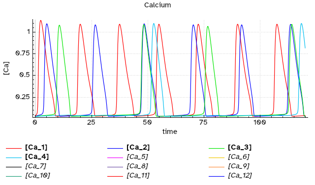
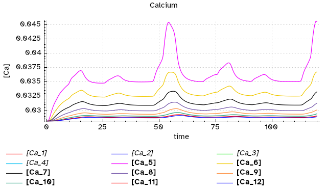
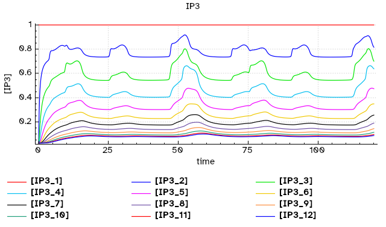
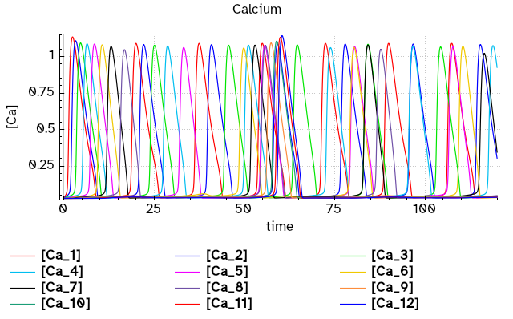
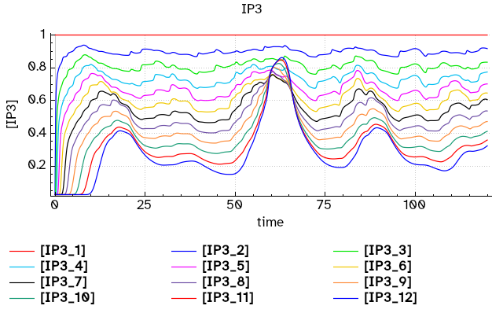

# Row of cells with gap junctions
## propagation of pulsating calcium waves in astrocyte networks

This follows the work of Goldberg *et al.* (1), which uses a model of calcium oscillations induced by IP3 from De Pittà  *et al.* (2), named ChI model, which is an extension of the Li-Rinzel model (3) where IP3 is a variable. They create a row of 12 cells (astrocytes) connected laterally by gap junctions that allow transport of IP3 between neighboring cells. They then trigger input of IP3 at one cell and check how the calcium waves propagate in the cell network. They examine two cases: one with gap junctions that operate like passive diffusion, and another where the kinetics of the gap junctions have a threshold.

Here we will use a COPASI version of the model in De Pittà *et al.* (2), *ChI_DePitta2009.cps*, as the base file. This encodes a single cell with the ChI model that has as variables: the cytoplasmic calcium concentration, cytoplasmic IP3 concentration, and *h* representing the proportion of open calcium channels in the ER membrane, and which is dependent on IP3 and calcium in the cytoplasm.

Because this cell topology is a single row, we have to provide the actual specific connectivity in a network file. This is because *sbmodelr* allows any arbitratry connections when the user specifies simply a number of cells. In 2D or 3D, *sbmodelr* assumes a rectangular or cuboid grid of connections, but with just a number of cells (1D) the connectivity has to be provided explicitly (this allows for completely arbitrary ways of connecting units). In this case we have a line of cells, so the content of network file *row_of_11.gv* is:

```
graph row_of_12 {
1 -- 2 -- 3 -- 4 -- 5 -- 6 -- 7 -- 8 -- 9 -- 10 -- 11 -- 12
}
```

These network files follow the syntax used by the Graphviz software ([DOT language](https://graphviz.org/doc/info/lang.html)), but with the limitation that the nodes must be identified by numbers.

### Case 1
This is a the case where IP3 is transported through simple diffusive kinetics (like mass action) (file *ex2case1.sh*). .

| command line options      | comment                                |
| ------------------------- | -------------------------------------- |
|``sbmodelr``               | run *sbmodelr*                         |
|`` --output ex2case1.cps`` | name the output file                   |
|`` -t IP3``                | transport the species IP3              |
|`` -k 2``                  | value of rate constant for transport   |
|`` -n row_of_12.gv``       | network file with the cell connections |
|`` ChI_DePitta2009.cps``   | COPASI file with the base unit         |
|`` 12``                    | create 12 units                        |

Running the command explained above (e.g. by running file *ex2case1.sh*) results in a new model file *ex2case1.cps*.
We then have to load this model into COPASI in order to:

 1. set the IP3  concentration in unit 1 fixed at value 1.0 (as in Figure 3 of ref. 1)
 2. create plots to display [Ca] and [IP3] in each cell

After doing these operations and saving the modified file as *ex2case1ready.cps*, we obtain figures that reproduce the behavior displayed in Fig. 3A and 3B of reference 1.



**Fig. 1.** Reproduction of behavior in Fig.3A of reference 1 for cells 1-4, constant IP3 is applied in cell 1 and this causes calcium waves of different frequencies in neighboring cells.



**Fig. 2.** Reproduction of behavior in Fig.3A of reference 1 for cells 5-12, constant IP3 is applied in cell 1 and this causes very small amplitude calcium waves in distant cells (c.f. scale in Fig. 1).



**Fig. 3.** Reproduction of behavior in Fig.3B of reference 1, constant IP3 is applied in cell 1 and this causes diminishing IP3 waves in distant cells.


### Case 2
This is very similar to the previous case except that transport of IP3 now follows a nonlinear sigmoidal function. Goldberg *et al.* use a sigmoidal function defined with a hyperbolic tangent (1) but *sbmodlr* has a Hill function to allow sigmoidal (or hyperbolic) transport kinetics. Here we will use Hill kinetics to approximate the behavior observed by Goldberg *et al.* (but see note 4 at the bottom!). To run the example see file *ex2case2.sh*, explained in the table below.

| command line options      | comment                                          |
| ------------------------- | ------------------------------------------------ |
|``sbmodelr``               | run *sbmodelr*                                   |
|`` --output ex2case2.cps`` | name the output file                             |
|`` --Hill-transport IP3``  | transport the species IP3 with Hill kinetics     |
|`` --transport-Vmax 4``    | value of Vmax for transport rate law             |
|`` --transport-Km 0.72``   | value of Km for transport rate law               |
|`` --transport-h 4``       | value of Hill coefficient for transport rate law |
|`` -n row_of_12.gv``       | network file with the cell connections           |
|`` ChI_DePitta2009.cps``   | COPASI file with the base unit                   |
|`` 12``                    | create 12 units                                  |

Running the command explained above (e.g. by running file *ex2case2.sh*) results in a new model file *ex2case2.cps*.
We then have to, again, load this model into COPASI in order to:

 1. set the IP3  concentration in unit 1 fixed at value 1.0 (as in Figure 3 of ref. 1)
 2. create plots to display [Ca] and [IP3] in each cell

After doing these operations and saving the modified file as *ex2case2ready.cps*, we obtain figures that approximately reproduce the behavior displayed in Fig. 3C and 3D of reference 1 (despite the kinetics being different).



**Fig. 4.** Approximate reproduction of behavior in Fig.3C of reference 1; constant IP3 is applied in cell 1 and this causes calcium waves of different frequencies in neighboring cells. Note that in this case there are oscillations in all cells, unlike in Fig. 1 with linear transport kinetics.



**Fig. 5.** Approximate reproduction of behavior in Fig.3D of reference 1, constant IP3 is applied in cell 1 and this causes diminishing IP3 waves in distant cells.


## References

1. Goldberg M, Pittà MD, Volman V, Berry H, Ben-Jacob E (2010) Nonlinear Gap Junctions Enable Long-Distance Propagation of Pulsating Calcium Waves in Astrocyte Networks. [PLOS Computational Biology 6:e1000909](https://doi.org/10.1371/journal.pcbi.1000909)
2. De Pittà M, Goldberg M, Volman V, Berry H, Ben-Jacob E (2009) Glutamate regulation of calcium and IP3 oscillating and pulsating dynamics in astrocytes. [Journal of Biological Physics 35:383–411](https://doi.org/10.1007/s10867-009-9155-y)
3. Li Y-X, Rinzel J (1994) Equations for InsP3 Receptor-mediated [Ca2+]i Oscillations Derived from a Detailed Kinetic Model: A Hodgkin-Huxley Like Formalism. [Journal of Theoretical Biology 166:461–473](https://doi.org/10.1006/jtbi.1994.1041)
4. Note that the equation given by Goldberg *et al.* for sigmoidal transport kinetics has a big problem that it is not defined for the case where the trasnported molecule has the same concentration on both sides and will generate a division by zero

